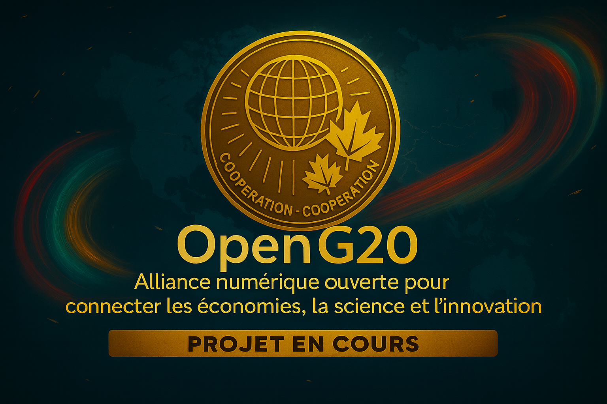

**Languages:** [English](#english) | [Français](#francais)

# 🌍 OpenG20

---

## 🇬🇧 English

**Open Digital Alliance to connect the economies, science and innovation of the G20**

🚧 **Current Status**: Under construction  

We are building an open ecosystem to connect G20 economies, strengthen scientific cooperation, and inspire a new way of addressing **climate risk disclosure**, **global sustainability**, and **humanitarian aid** in the AI era.  

---

### 🎯 Mission

OpenG20 is an open digital ecosystem in development, designed to:

- Connect G20 businesses, governments, scientists, and citizens through a common platform.  
- Ensure equitable access to science, technology, and innovation (STI).  
- Enable climate risk disclosure programs and transparent reporting at global summits.  
- Anticipate and respond to humanitarian and planetary crises.  
- Open the way to **Humanitarian Aid 2.0** by involving citizens as agents of change.  

---

### 🚀 Why it’s innovative

OpenG20 combines **technology**, **science & innovation**, and **international cooperation** in a unique platform.  

The processed data — economic, climate, scientific, and humanitarian — are powerful levers:  
- anticipating crises,  
- optimizing supply chains,  
- guiding climate and energy transitions,  
- fostering inclusive knowledge sharing.  

---

### 🌐 Domains and roles

- **openG20.org**  
  Public official website — presentation, interactive map, climate disclosure dashboard, business/resource search.  

- **openG20.center**  
  Technical and strategic coordination — documentation, APIs, research & development tracking.  

---

### 💡 Use cases

- Track and disclose climate risks at the international level.  
- Identify scientific and technological capacity gaps in developing countries.  
- Detect an imminent supply chain or energy disruption.  
- Share open research knowledge across the G20.  
- Launch a humanitarian project call in response to a planetary crisis.  

---

### 🌍 Humanitarian Aid 2.0

- Any citizen can report a local humanitarian or climate situation.  
- These reports can trigger a project call on the platform.  
- Public, private, scientific, and NGO actors can coordinate resources and logistics.  

---

### 🧪 Scientific cooperation

- Promote **open science** and equitable access to knowledge.  
- Build STI capacity in developing countries, particularly in Africa.  
- Strengthen trust in science and evidence-based policy advice.  
- Mobilize resources for **inclusive innovation and sustainability**.  

---

### 🏦 Invitation to G20 governments

We invite governments to integrate official data, foster sovereign digital infrastructures, and develop coordinated international responses for:  
- Sustainable Development Goals (SDGs)  
- Inclusive climate and energy transitions  
- Global knowledge sharing and resilience building  

---

### 📢 Official channels

📧 contact@openg20.org  
💬 Discord *(coming soon)*  
🔗 LinkedIn *(coming soon)*  

---

### 📜 License

Apache-2.0 — see LICENSE file.  

---

## 🇫🇷 Français

**Alliance numérique ouverte pour connecter les économies, la science et l’innovation du G20**

🚧 **Statut actuel** : En construction  

Nous bâtissons un écosystème numérique ouvert pour connecter les économies du G20, renforcer la coopération scientifique et inspirer une nouvelle façon d’aborder la **divulgation des risques climatiques**, la **durabilité mondiale** et l’**aide humanitaire** à l’ère de l’intelligence artificielle.  

---

### 🎯 Mission

OpenG20 est un écosystème numérique ouvert en développement, conçu pour :

- Connecter entreprises, gouvernements, scientifiques et citoyens du G20 via une plateforme commune.  
- Garantir un accès équitable à la science, la technologie et l’innovation (STI).  
- Mettre en place des programmes de divulgation des risques climatiques dans les grandes tribunes.  
- Anticiper et répondre aux crises humanitaires et planétaires.  
- Ouvrir la voie à **l’Aide humanitaire 2.0** en intégrant les citoyens comme acteurs du changement.  

---

### 🚀 Pourquoi c’est innovateur

OpenG20 combine **technologie**, **science & innovation** et **coopération internationale** dans un écosystème unique.  

Les données traitées — économiques, climatiques, scientifiques et humanitaires — sont de véritables leviers pour :  
- anticiper les crises,  
- optimiser les chaînes d’approvisionnement,  
- guider les transitions climatiques et énergétiques,  
- favoriser le partage équitable du savoir.  

---

### 🌐 Noms de domaine et rôles

- **openG20.org**  
  Site officiel grand public — présentation, carte interactive, tableau de divulgation climatique, moteur de recherche.  

- **openG20.center**  
  Centre de coordination technique et stratégique — documentation, API, suivi des recherches et développements.  

---

### 💡 Cas d’usage

- Suivre et divulguer les risques climatiques à l’échelle internationale.  
- Identifier les lacunes de capacité scientifique et technologique dans les pays en développement.  
- Détecter une rupture imminente dans une chaîne d’approvisionnement ou d’énergie.  
- Partager la connaissance scientifique ouverte entre pays du G20.  
- Initier un appel de projet humanitaire en réponse à une crise planétaire.  

---

### 🌍 Aide humanitaire 2.0

- Tout citoyen peut signaler une situation humanitaire ou climatique locale.  
- Ces témoignages peuvent déclencher un appel de projet sur la plateforme.  
- Les acteurs publics, privés, scientifiques et ONG peuvent coordonner les ressources et la logistique.  

---

### 🧪 Coopération scientifique

- Promouvoir la **science ouverte** et l’accès équitable aux savoirs.  
- Renforcer les capacités STI dans les pays en développement, en particulier en Afrique.  
- Consolider la confiance envers la science et les politiques fondées sur les faits.  
- Mobiliser des ressources pour l’**innovation inclusive et durable**.  

---

### 🏦 Invitation aux gouvernements du G20

Nous invitons les gouvernements à intégrer les données officielles, bâtir des infrastructures numériques souveraines et développer des réponses coordonnées pour :  
- Les Objectifs de développement durable (ODD)  
- Les transitions climatiques et énergétiques inclusives  
- Le partage global des connaissances et le renforcement des capacités  

---

### 📢 Canaux officiels

📧 contact@openg20.org  
💬 Discord *(à venir)*  
🔗 LinkedIn *(à venir)*  

---

### 📜 Licence

Apache-2.0 — voir le fichier LICENSE.
